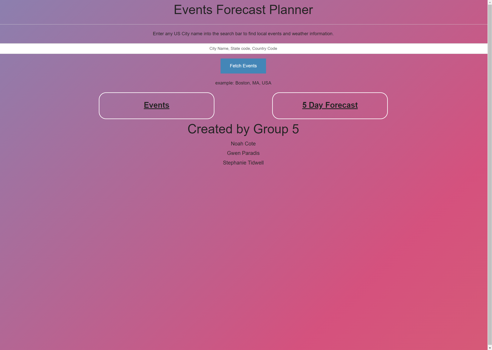

# EventsForecastPlanner

## Description
The motivation to create this application came from the group’s interest in outdoor activities and events, with the real world problem of weather variation affecting the experience of those events. This project was built to allow the User to find events in their desired location, while also including a weather forecast to allow the User to plan for that event accordingly. This solves the problem of allowing the user to make an informed decision about going to an outdoor event, travel plans, and more. The group learned how to integrate multiple API's in javascript, and style the received information with a new (to us) CSS framework, Foundation. The group learned how to delegate and collaborate on project elements to create fairness in workload and highlight the strengths of each group member. The group also learned how make individual working branches on github, complete pull requests, and then approve and merge those requests into our main branch.

## Installation

The application can be accessed at the following link: https://gwenparadis.github.io/EventsForecastPlanner/

## Usage

After the User accesses the application using the Installation guidelines, the user will be presented with the image in the screenshot below. The user can enter any city name (in the United States) into the search bar, using the following format: City Name, State Code, Country Code. When the User has typed their desired location in the search bar, the user can click Fetch Events. This will reveal the next 10 events within a 12 mile radius of their search location, as well as a 5-day forecast for that location.

## Credits

Collaborators:
Username: NoahCote10; Profile Link: https://github.com/NoahCote10;   
Username: StephTidwell; Profile Link: https://github.com/StephTidwell;   
Username: gwenparadis; Profile Link: https://github.com/gwenparadis;   

API's utilized in production:
Geolocation API from OpenWeatherMap;   
The SeatGeek Platform API from SeatGeek;   
Five Day Three Hour Forecast API from OpenWeatherMap;   

## License

NA
